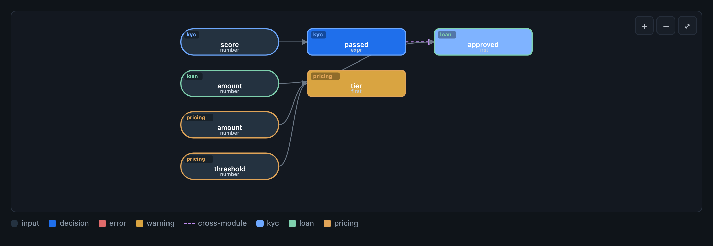

# feelc

[](https://github.com/maxgfr/feelc/actions/workflows/ci.yml)
[](https://github.com/maxgfr/feelc/releases)
[](./LICENSE)
[](https://go.dev/)
[](https://maxgfr.github.io/feelc/playground/)

> **An AI-native business-rules engine** (DMN/FEEL) **compiled to Go**: an LLM writes and explains the
> rules, and the engine *proves* and runs them — **100% deterministic, reproducible and auditable**
> (no LLM in the core). In the spirit of IBM ODM/ILOG, reimagined for the age of LLMs: author by
> chatting with your own model, visualize the decision graph, prove completeness & consistency, and ship
> a single CGO-free binary — or try it in your browser via WebAssembly.

**▶ [Try the playground](https://maxgfr.github.io/feelc/playground/)** — the real engine, compiled to
WebAssembly, runs entirely in your browser (no backend). Or [read the docs](https://maxgfr.github.io/feelc/).

## Quick start

One CGO-free static binary, no runtime dependencies:

```sh
git clone https://github.com/maxgfr/feelc && cd feelc
go build -o feelc ./cmd/feelc          # Go 1.23+ (or: docker build -t feelc .)

cat > tax.rules <<'RULES'
input income : number >= 0
decision band : string {
  needs: income
  hit: first
  >= 50000 => "high"
  >= 20000 => "medium"
  default  => "low"
}
RULES

./feelc verify --rules tax.rules                                  # proves it's complete & conflict-free
./feelc run    --rules tax.rules --decision band --input '{"income":30000}'   # → "medium"
./feelc serve  --ui                                              # or author it by chatting with your LLM
```

`verify` is the point: before you ever run a rule, the engine **proves** every input is covered and no
two rules conflict — with a concrete counterexample when they don't. Then `serve --ui` lets an LLM draft
the next rule while the engine keeps proving it.

## Why

Classic rule engines pit *business readability* against *reliable execution*. `feelc` reconciles
the two:

- **AI writes, the engine executes.** Rules are written in a readable `.rules` DSL (DMN paradigm:
  a graph of decisions, each a decision table, expressions in FEEL). An LLM can generate it
  natively. The Go compiler transforms it into typed, checked IR, executed by a small deterministic VM.
- **Formal verification.** `feelc verify` proves **completeness** (no uncovered case),
  the **absence of conflicts**, and detects **dead rules / redundancies** — with concrete counterexamples.
- **Hot-reload.** Rules are *data*: you update them on the fly, without recompiling the binary.
- **Auditable.** Each decision is replayable (model hash + explanation trace citing the source).
- **Scales to projects.** A workspace of many `.rules` modules links into one deterministic model;
  editing a single module re-compiles and re-verifies **only that module** (incremental, O(1) in
  project size), so AI authoring stays fast across hundreds of modules.

## What makes it AI-native

The LLM lives **only** at the authoring boundary; the engine (compile, verify, VM, explain) is pure,
deterministic Go that never calls a model. That separation is the point — it makes AI authoring *safe*:

- **Bring your own LLM.** Author by chatting with your own provider/model/key (Anthropic or any
  OpenAI-compatible endpoint); the key stays in your browser. No key ⇒ AI endpoints return `501` and
  the engine still works fully.
- **Verify → repair → converge.** The **ingest** endpoint (`POST /v1/ingest`) drafts a model, runs
  `verify` / `check`, feeds the deterministic blockers (with counterexample witnesses) back to the LLM,
  and repeats until clean — the **engine**, never the model, decides when it's done.
- **Traceability from the compiled model.** `@source` mappings and explanation traces are read from the
  compiled IR, never from LLM prose, so every decision cites its real origin.
- **Project-aware editing at scale.** Edit one module with full cross-module context via deterministic
  lexical retrieval (no embeddings) — see [Project mode](#project-mode).

## How it compares

Most rule engines make you **hand-write** rules and then **trust** them. feelc's bet is the opposite: the
**AI writes** the rules (plain text you review like code) and the **engine proves** them before they ship.

| | **feelc** | Drools | Camunda DMN | GoRules / ZEN | json-rules-engine |
|---|---|---|---|---|---|
| **AI authoring** | native — drafts *and* repairs against the engine | — | — | — | — |
| **Rule format** | plain-text `.rules`, **git-diffable** | DRL text | DMN 1.x **XML** | JSON model | JSON conditions |
| **Formal verification** | **in-engine**: completeness · conflicts · subsumption **(+ SMT)** | table analysis¹ | table analysis¹ | — | — |
| **Types & numbers** | typed · **exact decimal** (money-safe) | typed (JVM) | FEEL · decimal | dynamic | untyped JS |
| **Deploy** | **one static binary** / ~16 MB Docker, no LLM at runtime | JVM | JVM / BPM platform | Go/Rust lib | npm lib |
| **Try in browser** | **WASM playground** | — | modeler demo | playground | — |

¹ In fairness, Camunda (dmn-js *verify table*), Trisotech and Drools/DMN **do** offer decision-table
gap/overlap analysis — as modeling-tool features. feelc's is built into the **compiler** (adds subsumption
+ counterexamples + optional SMT) and ships in a single portable binary / WASM.

Rough by nature — each tool has strengths feelc doesn't (Drools' Rete/CEP, Camunda's BPM suite, GoRules'
polished visual editor). What's **unique to feelc** is the combination: text rules an AI drafts, a
deterministic engine that *proves* them, and a decision graph you can actually read — in a single binary.
Measured details: **[comparison & gaps](https://maxgfr.github.io/feelc/docs/comparison.html)** ·
**[conformance](https://maxgfr.github.io/feelc/docs/conformance.html)** (DMN TCK + 6 engines) ·
**[benchmarks](https://maxgfr.github.io/feelc/docs/benchmarks.html)** · **[embed in your app](https://maxgfr.github.io/feelc/docs/embedding.html)**.



*The built-in decision graph (`feelc serve --ui` or `feelc graph`): inputs and decisions across modules,
colour-coded per module, with the cross-module dependency dashed and verification findings overlaid. Pan,
zoom and click any node to inspect its type, hit policy, source line and findings.*

## Commands

```sh
feelc run     --rules m.rules --decision <name> --input '{…}' [--json]  # evaluate a decision
feelc compile --rules m.rules [-o m.ir.bin]                             # compile to canonical IR
feelc verify  --rules m.rules [--json]                                  # formal check (gaps/conflicts)
feelc explain --rules m.rules --decision <name> --input '{…}' [--json]  # justification trace
feelc check   --rules m.rules --claims claims.json [--json]             # NL↔rule semantic gate
feelc fmt     --rules m.rules [-w] [--check]                            # canonical pretty-printer
feelc import  --in model.dmn  [-o m.rules]                              # import DMN XML
feelc export  --rules m.rules [-o model.dmn]                            # export to DMN XML
feelc tck     --suite <dir>   [--json] [--min <pct>]                    # DMN TCK conformance
feelc graph   --rules m.rules [--format mermaid|dot|json]               # decision graph (DRG) + findings
feelc inputs  --rules m.rules --decision <name>                         # inputs a decision needs (question-flow)
feelc docs    --rules m.rules [-o DOC.md]                               # Markdown reference + Mermaid graph
feelc serve   --rules m.rules [--addr :8080] [--watch] [--strict] [--ui] # HTTP service + hot-reload (+ AI UI)
feelc serve   --project <dir>  [--addr :8080] [--watch] [--strict] [--ui] [--allow-edit] # multi-module PROJECT
feelc version                                                          # print the build version
```

The CLI flags, exit codes and the full HTTP route table are in the
[CLI reference](https://maxgfr.github.io/feelc/docs/cli.html) and
[HTTP API reference](https://maxgfr.github.io/feelc/docs/http-api.html).

## Project mode

For more than a single file, a **project** is a directory of `.rules` modules plus an optional
`feelc.project.json` manifest. The modules are namespaced (`module__decision`) and **linked into one
deterministic model** the engine runs unchanged — a single hash, one verification pass, one decision
graph. Modules reference each other through a manifest `uses` binding (a local input wired to
`other.decision`); cross-module cycles and dangling refs are rejected at load. The web UI (`--ui`) gains
a module navigator, a project health dashboard, and a cross-module graph; adding **`--allow-edit`**
(off by default — the editing surface is unauthenticated, so keep it on a trusted/loopback host) enables a
per-module editor with server-side **Save** + create/delete, persisted to the mounted directory under a
golden rule: an invalid edit is rejected and the live project is kept. See the
**[project-mode guide](docs/project-mode.md)** (also on
the [docs site](https://maxgfr.github.io/feelc/docs/project-mode.html)), [`sample-project/`](sample-project/),
and [ADR 0015](docs/adr/0015-project-mode.md). Ships as a Docker service:

```sh
docker build -t feelc .
docker run --rm -p 8080:8080 -v "$PWD/sample-project:/work" feelc   # open http://localhost:8080/
```

## Status

Core **operational**: language → compiler → IR → deterministic VM (exact decimal), 6 hit policies,
**formal verification** (completeness/conflicts/dead rules with counterexamples), **HTTP service +
hot-reload**, **semantic gate** (`check`), **DMN XML import**. Verified reference models live under
[`examples/`](examples/). Optional **SMT (Z3) backend** (`-tags smt`,
[ADR 0007](docs/adr/0007-smt-backend.md)) discharges non-geometric `Op=Prog`
residuals — completeness *and* conflict proofs over `if/then/else`, `floor/ceiling/round`,
cross-column cells (honest `not-verifiable` when `z3` is absent).

Modelling reach: **decision-graph visualization** (`feelc graph`
+ the UI, ADR 0009), **rule metadata & law/source traceability** (`@title/@doc/@question/@source`,
ADR 0010), an **interactive question-flow / simulator** (ADR-backed `feelc inputs` + the UI form),
**progressive brackets** (`bracket:`, ADR 0011), **physical units & money** with compile-time
dimensional analysis (ADR 0012), **applicability** (non-applicable values, ADR 0013), and **date /
duration** types with sound whole-day arithmetic (ADR 0014). Deferred: multi-arg built-ins
(ADR 0004 §3) and out-of-subset temporal forms (times of day, date-times, year-month durations).
Generate docs with `feelc docs` (Markdown + Mermaid graph), or scaffold a cited repo reference with
the external [ultradoc](https://github.com/maxgfr/ultradoc) skill.

## AI writes the rules (two paths)

Per the thesis — **AI authors, the engine executes** — there are two interchangeable authoring paths.
The LLM only drafts `.rules`; every result you see comes from the deterministic engine
(see [ADR 0008](docs/adr/0008-ai-authoring-layer.md)).


*The **engine**, not the LLM, decides when authoring is done: it drafts, verifies, and feeds the
deterministic blockers (with counterexamples) back for repair until the model is provably complete and
consistent (`POST /v1/ingest`, or the skill's red→green loop).*

**1. In-browser chat UI (bring-your-own LLM).** `feelc serve --ui` serves a zero-dependency embedded
UI: chat to describe your rules, the assistant drafts the model, and one click runs `verify` / `run`
on the deterministic engine. It also renders the **decision graph**, builds a **simulator form** that
asks only the inputs a decision needs, narrates a result in **plain English** ("Explain"), and
**generates test cases** that are then checked deterministically. Configure your own
provider/model/API key in ⚙ settings (Anthropic or any OpenAI-compatible endpoint). The key stays in
your browser and transits only your local server; it is never stored or logged. With no key (request
or `ANTHROPIC_API_KEY` env), AI endpoints return `501` and the engine still works.

```sh
feelc serve --ui            # then open http://localhost:8080/ (no --rules needed)
```

**2. Claude Code + the bundled skill.** A **portable skill** (Claude Code, Codex, Cursor…) is bundled
in [`skill/`](skill/): it guides an agent through the *interview → DSL → `verify` → `run` → iterate*
flow, using `feelc` as a deterministic oracle. See [`skill/SKILL.md`](skill/SKILL.md).

```sh
node skill/scripts/feelc-skill.mjs verify --rules examples/credit/credit.rules --json
```

## Example

```
model "credit" {
  rounding: half_even
}

input credit_score  : number in [300..850]
input annual_income : number >= 0
input monthly_debt  : number >= 0
input age           : number in [0..120]

decision dti : number = monthly_debt / (annual_income / 12)

decision eligibility : Eligibility {
  needs: credit_score, dti, age
  hit: first
  #  credit_score | dti     | age   => eligible | reason
     < 580        | -       | -     => false    | "insufficient score"
     -            | > 0.43  | -     => false    | "debt too high"
     -            | -       | < 18  => false    | "minor"
     [580..680)   | <= 0.43 | >= 18 => true     | "approved with conditions"
     >= 680       | <= 0.43 | >= 18 => true     | "approved"
     default      |         |       => false    | "not covered"
}
```

## Contributing

Build & test instructions, the [architecture map](docs/architecture.md), and the append-only
**decision-record** lifecycle are in [CONTRIBUTING](./CONTRIBUTING.md). Browse the
[decision records](https://maxgfr.github.io/feelc/docs/adr/) to see *why* feelc is built the way it is.

## License

Apache-2.0. See [LICENSE](./LICENSE).
